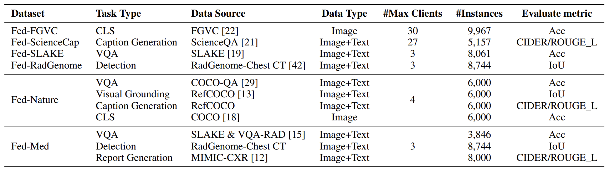

# FedVLM

# FedVLMBench: Benchmarking Federated Fine-Tuning of Vision Language Models

**OpenFedLLM** is a systematic benchmark for federated fine-tuning of VLMs. 
Please check our [paper](https://arxiv.org/abs/2506.09638) for details and the corresponding empirical study.
Please check our [dataset](https://www.kaggle.com/datasets/robinlin2002/fedvlmbench) in Kaggle.


FedVLMBench includes the following key features:
- 2 **mainstream VLM architectures** architecturess (e.g., *show-o*, *LLaVa*).
- 4 **fine-tuning strategies** 
- 5 **FL algorithms** (e.g., *FedAvg*, *FedProx*, *SCAFFOLD*, *FedAvgM*, etc.).
- 6 **multimodal datasets** spanning 4 cross-domain single-task scenarios and 2 cross-domain multitask settings.

<details open>
<summary><b>Main Figure:</b></summary>


</details>


## Table of Contents
- [1.Prerequisites](#1prerequisites)
- [2.Installation](#2installation)
- [3.Configuration](#3configuration)
- [4.Downloading](#4downloading)
- [5.Running Experiments](#5running-experiments)
- [6.License](#6license)

## 1.Prerequisites

- Linux operating system
- NVIDIA GPU with CUDA capability
- Conda package manager
- Python 3.8+


## 2.Installation

```
conda env create -f env.yaml
conda activate fedvlm
```


## 3.Configuration

<details close>
<summary><b>Code:</b></summary>
<pre>
/OpenFedLLM-main
├── /Nature_Multi      #code for multi-task collaborative fedrated datasets
│   ├── main_encoder_based_fed_natural.py
│   ├── main_encoder_free_fed_natural.py
│   ├── main_encoder_based_local_natural.py
│   └── main_encoder_free_local_natural.py
├── /FGVC              #code for single-task fedrated datasets
│   ├── main_encoder_based_fed_fgvc.py
│   ├── main_encoder_free_fed_fgvc.py
│   ├── main_encoder_based_local_fgvc.py
│   └── main_encoder_free_local_fgvc.py
└── /gen_config        #code for config generation 
    ├── /encoder_free
    │   ├── gen_Natural_Multi_config.py
    │   └── gen_FGVC_config.py
    └── /encoder_based
        ├── gen_FGVC_config.py
        └── gen_Nature_Multi_config.py
</pre>

</details>


<details open>
<summary><b>Dataset Summary:</b></summary>



</details>


<details close>
<summary><b>Fed-FGVC: A Classification Vision-Language FL Dataset with 9,967 instances</b></summary>
<pre>
/Fed-FGVC
├── /clients
│   ├── /train
│   └── /test
└── /central_training
    ├── /train
    └── /test
</pre>

</details>


<details close>
<summary><b>Fed-Nature: A Natural Multitask Vision-Language FL Dataset with 24,000 instances</b></summary>
<pre>
/Fed-Nature
├── /clients
│   ├── /train
│   └── /test
└── /central_training
    ├── /train
    └── /test
</pre>
</details>

<details close>
<summary><b>Fed-Med: A Medical Multitask Vision-Language FL Dataset with 20,590 instances.</b></summary>
<pre>
/Fed-Med
├── /image
│   ├── /MIMIC-CXR
│   ├── /RadGnome
│   ├── /slake
│   └── /RAD-VQA
├── /clients
│   ├── /train
│   └── /test
└── /central_training
    ├── /train
    └── /test
</pre>
</details>


<details close>
<summary><b>Fed-RadGenome: A Visual Detection Vision-Language FL Dataset with 8,744 instances.</b></summary>
<pre>
/Fed-RadGenome
├── /clients
│   ├── /train
│   └── /test
└── /central_training
    ├── /train
    └── /test
</pre>
</details>

<details close>
<summary><b>Fed-SLAKE: A Visual Question Answering Vision-Language FL Dataset with 8,061 instances.</b></summary>
<pre>
/Fed-SLAKE
├── /clients
│   ├── /train
│   └── /test
└── /central_training
    ├── /train
    └── /test
</pre>
</details>

<details close>
<summary><b>Fed-ScienceCap: A Caption Generation Vision-Language FL Dataset with 5,157 instances. </b></summary>
<pre>
/Fed-ScienceCap
├── /clients
│   ├── /train
│   └── /test
└── /central_training
    ├── /train
    └── /test
</pre>
</details>


## 4.Downloading

### Step1: Download Models


First, Download the models in the ./pretrained_models 


<details close>
<summary><b>LLaMA-Instruct 3.2 3B:</b></summary>

<pre>
from transformers import AutoTokenizer, AutoModelForCausalLM
tokenizer = AutoTokenizer.from_pretrained("meta-llama/Llama-3.2-3B-Instruct")
model = AutoModelForCausalLM.from_pretrained("meta-llama/Llama-3.2-3B-Instruct")
</pre>

</details>


<details close>
<summary><b>CLIP ViT-B-32:</b></summary>

<pre>
from transformers import AutoProcessor, AutoModelForZeroShotImageClassification
processor = AutoProcessor.from_pretrained("openai/clip-vit-base-patch32")
model = AutoModelForZeroShotImageClassification.from_pretrained("openai/clip-vit-base-patch32")
</pre>

</details>


<details close>
<summary><b>Show-o 1.5B:</b></summary>

https://huggingface.co/showlab/show-o-512x512/tree/main

</details>


### Step2: Download Images
Download the images in the ./images


<details close>
<summary><b>Natural Image Datasets:</b></summary>
    
1. **FGVC Aircraft** [download](https://www.robots.ox.ac.uk/~vgg/data/fgvc-aircraft/)  
   <sub>*10,200 aircraft images with fine-grained annotations*</sub>

2. **COCO** [download](https://cocodataset.org/#home)  
   <sub>*330K images for object detection/segmentation*</sub>

3. **RefCOCO** [download](https://github.com/lichengunc/refer)  
   <sub>*142K referring expressions for 50K COCO images*</sub>

4. **COCO-QA** [download](https://www.cs.toronto.edu/~mren/research/imageqa/data/cocoqa/)  
   <sub>*78K visual questions based on COCO images*</sub>

5. **ScienceQA** [download](https://scienceqa.github.io/)  
   <sub>*21K multimodal science questions with explanations*</sub>
</details>


<details close>
<summary><b>Medical Imaging Datasets:</b></summary>
    
6. **RadGenome-ChestCT** [download](https://huggingface.co/datasets/RadGenome/RadGenome-ChestCT)  
   <sub>*3D CT scans with anatomical structure annotations*</sub>

7. **VQA-RAD** [download](https://huggingface.co/datasets/flaviagiammarino/vqa-rad)  
   <sub>*315 medical images with clinical QA pairs*</sub>

8. **MIMIC-CXR** [download](https://physionet.org/content/mimic-cxr/2.1.0/)  
   <sub>*377K chest radiographs with free-text reports*</sub>

9. **SLAKE** [download](https://www.med-vqa.com/slake/)  
   <sub>*642 medical images with bilingual (EN/ZH) QA pairs*</sub>
</details>


## 5.Running Experiments

### Step1: Generate Configuration Files
Generate your configuration files before running experiments:
```
# Generate Natural_Multi configs
python gen_config/encoder_free/gen_Natural_Multi_config.py
python gen_config/encoder_based/gen_Natural_Multi_config.py

# Generate FGVC configs  
python gen_config/encoder_free/gen_FGVC_config.py
python gen_config/encoder_based/gen_FGVC_config.py
```

How to modify the configs? What can I modify?
- encoder-based or encoder free
- 4 kinds of finetuning strategies 
- 5 fedrated algorithm
- 6 different datasets
- iid / non-iid setting in fedrated learning
- other hyperparameters

```
    generate_fed_yaml(
        fed_alg=method,                                   #5 fedrated algorithm (fedavg, fedprox, fedyogi, fedadam, fedadagrad)
        task_type=f"pro_lora",                            #4 fintuning strategy (F-C, F-L, F-CL, F-2stage)
        data_path= f"./data/Fed-FGVC/",                   #6 different datasets (Fed-FGVC, Fed-ScienceCap, Fed-SLAKE, Fed-RadGenome, Fed-Nature, Fed-Med)
        output_dir=f"./output/Fed-FGVC/encoder_based/fed/pro_lora/{data_split}/{method}/",   
        avg_lora=True,                                    #fintuning strategy 1
        lora_enable=True,                                 #fintuning strategy 2
        avg_projector=True,                               #fintuning strategy 3
        tune_mm_mlp_adapter=True,                         #fintuning strategy 4
        task_name="Fed-FGVC",                             #task name
        yaml_path=f"./FGVC/config_encoder_based/fed/{data_split}/{method}/pro_lora_config.yaml"

    )
```


### Step2: Run Training Experiments
```
# Federated training (encoder_free VLM)
python Nature_Multi/main_encoder_free_fed_natural.py --config_path ./Nature_Multi/encoder_free/fedavg_auto/config.yaml

# Central training (encoder-based VLM) 
python Nature_Multi/main_encoder_based_local_natural.py --config_path ./Nature_Multi/encoder_based/cent_auto/config.yaml


# Federated training (encoder_free VLM)
python Nature_Multi/main_encoder_free_fed_natural.py --config_path ./Nature_Multi/encoder_free/fedavg_auto/config.yaml

# Central training (encoder-based VLM)
python Nature_Multi/main_encoder_based_local_natural.py --config_path ./Nature_Multi/encoder_based/cent_auto/config.yaml

```

### Example: Performance comparison of different VLM architectures on various single-task datasets with IID and non-IID distributions

<details open>
<summary><b>Example:</b></summary>


</details>
<pre>
python gen_config/encoder_based/gen_FGVC_config.py 
python gen_config/encoder_based/gen_SLAKE_config.py 
python gen_config/encoder_based/gen_RadGenome_config.py 
python gen_config/encoder_based/gen_ScienceCap_config.py 
</pre>

<pre>
python FGVC/main_encoder_based_fed_fgvc.py --config_path ./FGVC/encoder_free/fedavg_auto/config.yaml
python FGVC/main_encoder_based_fed_fgvc.py --config_path ./FGVC/encoder_free/fedprox_auto/config.yaml
python FGVC/main_encoder_based_fed_fgvc.py --config_path ./FGVC/encoder_free/fedprox_auto/config.yaml
    ...
python SLAKE/main_encoder_based_fed_slake.py --config_path ./SLAKE/encoder_free/fedadam_auto/config.yaml
python SLAKE/main_encoder_based_fed_slake.py --config_path ./SLAKE/encoder_free/fedavgm_auto/config.yaml
python SLAKE/main_encoder_based_fed_slake.py --config_path ./SLAKE/encoder_free/fedyogi_auto/config.yaml
</pre>


## 6.Citation


## Acknowledgements
This repo is based on [OpenfedLLM](https://github.com/rui-ye/OpenFedLLM), [Show-o](https://github.com/showlab/Show-o), and [LLAVA](https://github.com/haotian-liu/LLaVA), thanks to the original authors for their works!
